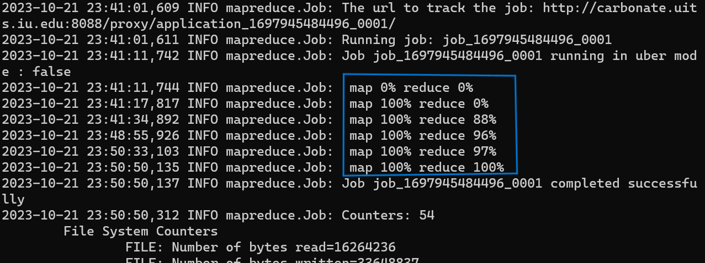
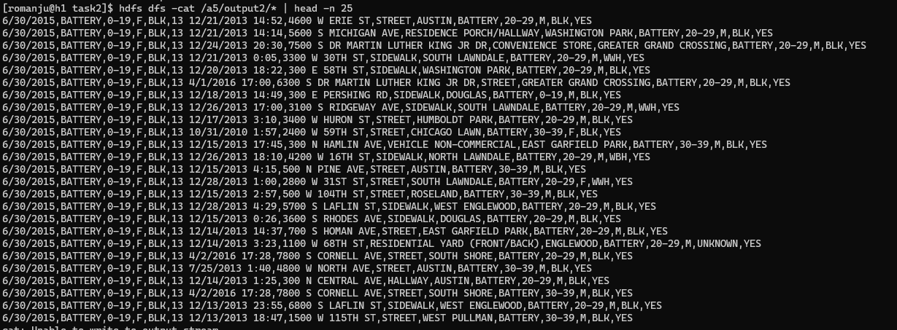
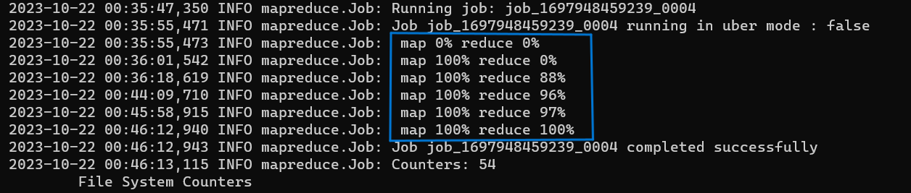
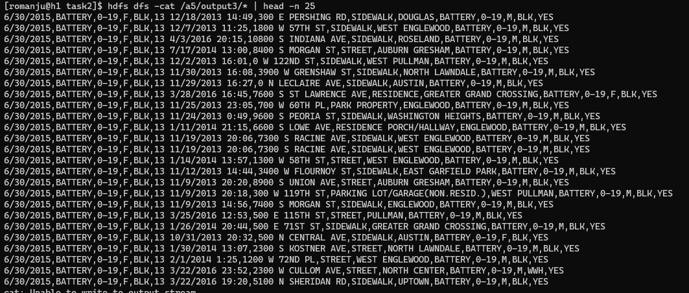
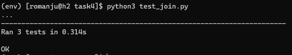

# Hadoop-Data-Joiner

## Task 1: Dataset familiarization
Dataset 1: [Violence Reduction - Victim Demographics - Aggregated](https://catalog.data.gov/dataset/violence-reduction-victim-demographics-aggregated)

Number of Fields: 6

Fields Description:

- **TIME_PERIOD**: Date of the incident (MM/DD/YYYY).

- **VICTIMIZATION_PRIMARY**: Primary type of crime.

- **AGE**: Age range of individuals involved.

- **SEX**: Gender of individuals (M/F/UNKNOWN).

- **RACE**: Race or ethnicity of individuals.

- **NUMBER_OF_VICTIMS**: Number of victims in the incident.


Dataset 2: [Violence Reduction - Victims of Homicides and Non-Fatal Shootings](https://catalog.data.gov/dataset/violence-reduction-victims-of-homicides-and-non-fatal-shootings)

Number of Fields: 8

Fields Description:

- DATE: Date and time of the incident (MM/DD/YYYY HH:MM).

- BLOCK: Location where the incident occurred, in block format.

- LOCATION_DESCRIPTION: Type of location where the incident took place (e.g., apartment, street).

- COMMUNITY_AREA: Specific community area where the incident occurred.

- VICTIMIZATION_PRIMARY: Primary type of crime.

- AGE: Age range of individuals involved.

- SEX: Gender of individuals (M/F/UNKNOWN).

- RACE: Race or ethnicity of individuals.

- GUNSHOT_INJURY_I: Indicator of whether the injury resulted from a gunshot (YES/NO).


#### Upload the datasets into Hadoop using the following commands

``` 
hdfs dfs -put local_path/Dataset1.csv /folder_in_hdfs
hdfs dfs -put local_path/Dataset2.csv /folder_in_hdfs 
```


## Task 2: Implementing a MapReduce Job for Data Joining

### Objective
The objective of Task 2 is to implement a MapReduce job to join data from two different datasets based on common columns. 

Output the joined results in the format: 

```<columns from Dataset 1> <columns from Dataset 2>```

### Files
1. **join_mapper.py**: The Mapper code which reads input data and emits key-value pairs with dataset identifiers.

2. **join_reducer.py**: The Reducer code which performs the join operation based on common columns.

### Usage
To execute the MapReduce job, you can use Hadoop Streaming. Here's an example command:

```
mapred streaming \
-input /path_to_datasets_folder/* \
-output /path_to_output \
-file local_path/join_mapper.py -mapper "python3 join_mapper.py" \
-file local_path/join_reducer.py -reducer "python3 join_reducer.py"
```


### Output
The MapReduce job will generate joined data based on specified columns (*VICTIMIZATION_PRIMARY*) from both datasets.

#### To the see the output:
```
hdfs dfs -cat /path_to_output/* | head -n 25
```



## Task 3: Modifying MapReduce Job for Secondary Sorting

### Objective

Task 3 aims to modify the MapReduce job implemented in Task 2 to include secondary sorting. The joined data will be sorted in ascending order based on specific columns in each dataset.

### Files
1. **sort_mapper.py**: The Mapper code which reads input data and emits key-value pairs with dataset identifiers (same as Task 2).

2. **sort_reducer.py**: The Reducer code which performs the join operation based on common columns and sort it based on the column specified (*Age*).

### Usage
The execution method remains the same as Task 2. You can use Hadoop Streaming to run the MapReduce job.

```
mapred streaming \
-input /path_to_datasets_folder/* \
-output /path_to_output \
-file local_path/sort_mapper.py -mapper "python3 sort_mapper.py" \
-file local_path/sort_reducer.py -reducer "python3 sort_reducer.py"
```



### Output
The output of the MapReduce job will be the joined data sorted in ascending order based on the specified column (*Age*) from both datasets.

#### To the see the output:
```
hdfs dfs -cat /path_to_output/* | head -n 25
```



## Task 4: Testing with MRUnit

### Objective
Task 4 focuses on testing the MapReduce job implemented in Task 2 using MRUnit. MRUnit is a testing framework for Hadoop MapReduce jobs. The objective is to validate the correctness of the MapReduce job's output through unit tests.

### Files
1. **test_join.py**: This Python script contains unit test cases for the MapReduce job. It uses MRUnit to run tests and check if the expected output matches the actual output.

### Usage
To run the unit tests, you can execute the test_join.py script. MRUnit will be used to test the MapReduce job.

```
python3 test_join.py
```

### Test Cases
Test cases used in test_join.py include:
1. Test Case 1:
    
    ```python
    Input_1 = "6/30/2018,HOMICIDE,50-59,M,BLK,4"
    Input_2 = "9/4/1992 4:33,400 W 101ST STREET,AUTO,WASHINGTON HEIGHTS,HOMICIDE,20-29,M,BLK,YES"
    Expected_Output = "6/30/2018,HOMICIDE,50-59,M,BLK,4 | 9/4/1992 4:33,400 W 101ST STREET,AUTO,WASHINGTON HEIGHTS,HOMICIDE,20-29,M,BLK,YES"
    ```
2. Test Case 2:
    ```python
    Input_1 = "6/30/2015,BATTERY,0-19,F,BLK,13"
    Input_2 = "12/21/2013 14:52,4600 W ERIE ST,STREET,AUSTIN,BATTERY,20-29,M,BLK,YES"
    Expected_Output = "6/30/2015,BATTERY,0-19,F,BLK,13 | 12/21/2013 14:52,4600 W ERIE ST,STREET,AUSTIN,BATTERY,20-29,M,BLK,YES"
    ```
3. Test Case 3:
    ```python
    Input_1 = "6/30/2019,ROBBERY,UNKNOWN,F,UNKNOWN,1"
    Input_2 = "8/30/1992 16:55,10700 S STATE,GARAGE,ROSELAND,HOMICIDE,0-19,M,BLK,NO"
    Expected_Output = None
    ```
### Testing Process
The unit tests will execute the MapReduce job with predefined test data and check if the actual output matches the expected output for each test case. The test results will be displayed in the console.

### Results
The results indicate whether the MapReduce job is functioning correctly, as it should produce the expected output for each test case.




